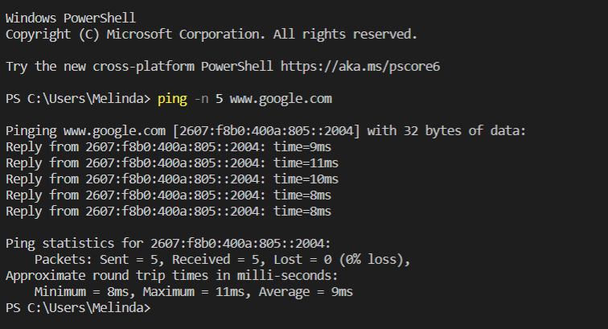

# Project 1

### Purpose
- Continue practicing using operating system's command line interface (CLI) to execute commands
- Create and execute code using JavaScript Node.js and Visual Studio Code.

### Technologies
- VSCode
- Node.js
- VSCode terminal and command line interface (CLI)

### Takeaways
- Used CLI commands to create folders and list in a tree structure
- Practiced using CLI commands to ping a domain and breaking out of a hanging CLI process 
- Practiced writing and executing Node.js JavaScript code
- Practiced documenting and explaining code 

## Images ##

### Using CLI to create folder structure ### 

### Folder tree structure ### 

### Using break keyboard sequence to break out of ping ### 

### Response to domain ping on Windows ### 

